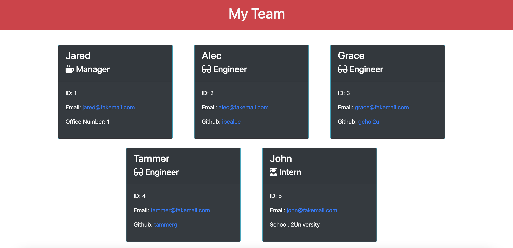
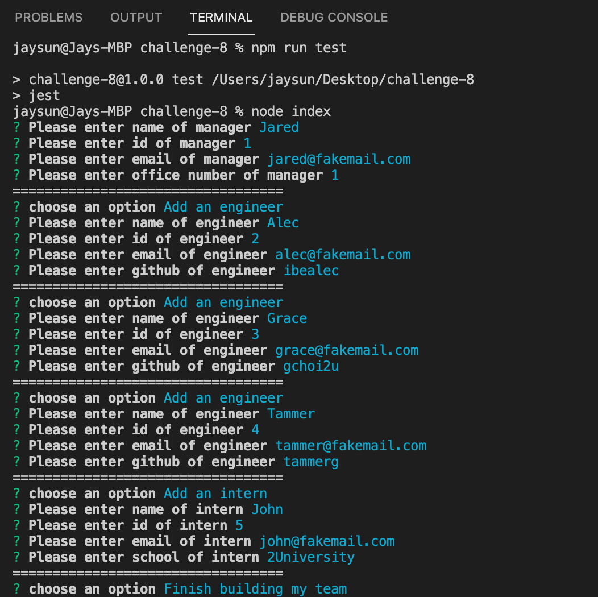
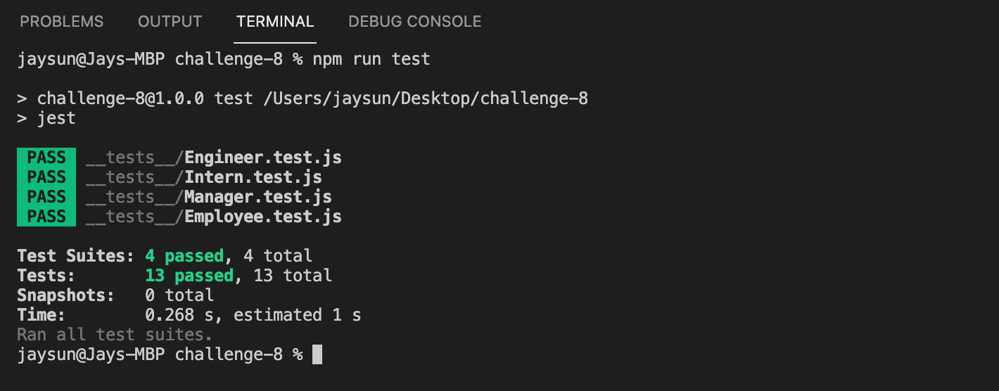

# Team Profile Generator

[![Contributors][contributors-shield]][contributors-url]
[![Forks][forks-shield]][forks-url]
[![Stargazers][stars-shield]][stars-url]
[![Issues][issues-shield]][issues-url]
[![MIT License][license-shield]][license-url]

<!-- PROJECT LOGO -->
<br />
<p align="center">
  <a href="https://github.com/jsun994/pro-team-profile-gen">
    
  </a>

  <p align="center">
  A professional team profile generator for users.
    <br />
    <a href="https://github.com/jsun994/pro-team-profile-gen"><strong>Explore the docs »</strong></a>
    <br />
    <br />
    <a href="https://github.com/jsun994/pro-team-profile-gen/tree/main/dist">View Demo</a>
    ·
    <a href="https://github.com/jsun994/pro-team-profile-gen/issues">Report Bug</a>
    ·
    <a href="https://github.com/jsun994/pro-team-profile-gen/issues">Request Feature</a>
  </p>
</p>

<!-- TABLE OF CONTENTS -->
<details open="open">
  <summary><h2 style="display: inline-block">Table of Contents</h2></summary>
  <ol>
    <li>
      <a href="#about-the-project">About The Project</a>
      <ul>
        <li><a href="#built-with">Built With</a></li>
      </ul>
    </li>
    <li>
      <a href="#getting-started">Getting Started</a>
      <ul>
        <li><a href="#prerequisites">Prerequisites</a></li>
        <li><a href="#installation">Installation</a></li>
      </ul>
    </li>
    <li><a href="#usage">Usage</a></li>
    <li><a href="#tests">Tests</a></li>
    <li><a href="#contributing">Contributing</a></li>
    <li><a href="#contact">Contact</a></li>
  </ol>
</details>

<!-- ABOUT THE PROJECT -->
## About The Project


[]()

### Built With

* Node JS
* NPM
* Jest
* Bootstrap

<!-- GETTING STARTED -->
## Getting Started

To get a local copy up and running follow these simple steps.

### Prerequisites

This is an example of how to list things you need to use the software and how to install them.
* npm
  ```sh
  npm install npm@latest -g
  ```

### Installation

1. Clone the repo
   ```sh
   git clone git@github.com:jsun994/pro-team-profile-gen.git
   ```
2. Install NPM packages
   ```sh
   npm install
   ```

<!-- USAGE EXAMPLES -->
## Usage

    GIVEN a command-line application that accepts user input
    WHEN I am prompted for my team members and their information
    THEN an HTML file is generated that displays a nicely formatted team roster based on user input
    WHEN I click on an email address in the HTML
    THEN my default email program opens and populates the TO field of the email with the address
    WHEN I click on the GitHub username
    THEN that GitHub profile opens in a new tab
    WHEN I start the application
    THEN I am prompted to enter the team manager’s name, employee ID, email address, and office number
    WHEN I enter the team manager’s name, employee ID, email address, and office number
    THEN I am presented with a menu with the option to add an engineer or an intern or to finish building my team
    WHEN I select the engineer option
    THEN I am prompted to enter the engineer’s name, ID, email, and GitHub username, and I am taken back to the menu
    WHEN I select the intern option
    THEN I am prompted to enter the intern’s name, ID, email, and school, and I am taken back to the menu
    WHEN I decide to finish building my team
    THEN I exit the application, and the HTML is generated



<!-- TESTS -->
## Tests



<!-- CONTRIBUTING -->
## Contributing

1. Fork the Project
2. Create your Feature Branch (`git checkout -b feature/AmazingFeature`)
3. Commit your Changes (`git commit -m 'Add some AmazingFeature'`)
4. Push to the Branch (`git push origin feature/AmazingFeature`)
5. Open a Pull Request

<!-- CONTACT -->
## Contact

Jay Sun - jaysun054@gmail.com

[contributors-shield]: https://img.shields.io/github/contributors/jsun994/pro-team-profile-gen.svg?style=for-the-badge
[contributors-url]: https://github.com/jsun994/pro-team-profile-gen/graphs/contributors
[forks-shield]: https://img.shields.io/github/forks/jsun994/pro-team-profile-gen.svg?style=for-the-badge
[forks-url]: https://github.com/jsun994/pro-team-profile-gen/network/members
[stars-shield]: https://img.shields.io/github/stars/jsun994/pro-team-profile-gen.svg?style=for-the-badge
[stars-url]: https://github.com/jsun994/pro-team-profile-gen/stargazers
[issues-shield]: https://img.shields.io/github/issues/jsun994/pro-team-profile-gen.svg?style=for-the-badge
[issues-url]: https://github.com/jsun994/pro-team-profile-gen/issues
[license-shield]: https://img.shields.io/github/license/jsun994/pro-team-profile-gen.svg?style=for-the-badge
[license-url]: https://github.com/jsun994/pro-team-profile-gen/blob/master/LICENSE.txt